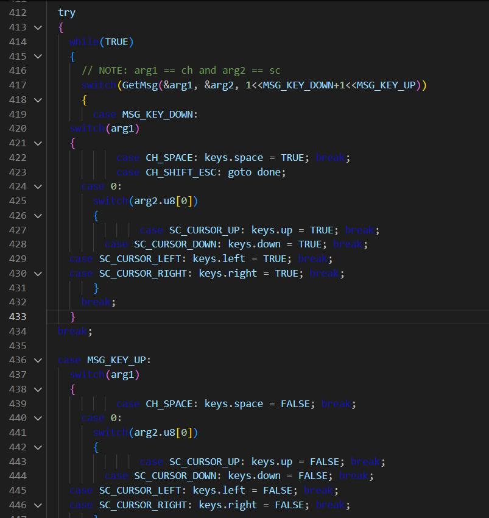
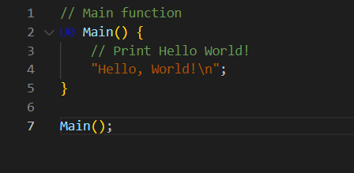

# HolyC Code Syntax

Welcome to HolyC Code Syntax, code HolyC more faster and more simply

## Features

How look like the Code Syntax in Visual Studio Code

### Game.hc

### Main.hc

## Requirements

Just know how to code HolyC ;)

## Release Notes

### 1.0.0

> All basic **HolyC** language added

---

## For more information

* [My Github for support and help](https://github.com/Creator754915/HolyC-Code-Syntax)

**Enjoy!**
